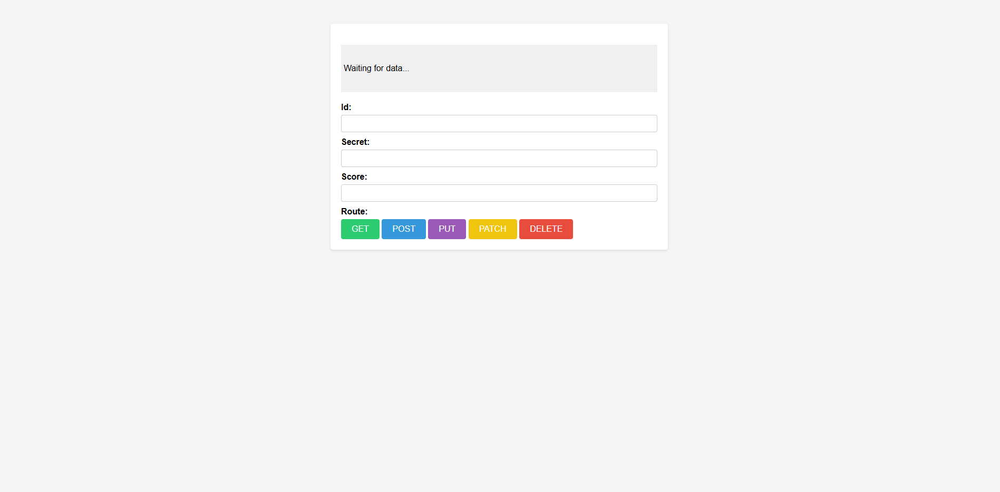

# Secure Secrets API

[]()

A secure REST API built with Node.js, Express.js, and Axios, providing a simple web interface for managing secrets with full CRUD (Create, Read, Update, Delete) operations.

## ✨ Features

- **Secure Authentication:** Utilizes Bearer token authentication to protect API endpoints.
- **Full CRUD Operations:** Supports creating, reading, updating, and deleting secrets.
- **Simple Web Interface:** Provides a user-friendly interface for interacting with the API.
- **Dynamic Content Rendering:** Uses EJS to dynamically render API responses.
- **Error Handling:** Provides informative error responses to the user.

## 🛠️ Technologies Used

### Backend:

- Node.js
- Express.js
- Axios
- Body-parser (for parsing request bodies)

### Frontend:

- EJS (Embedded JavaScript Templates)
- HTML
- CSS (Basic styling)

### Data:

- Secrets are managed via the external `secrets-api.appbrewery.com` API

## 🚀 Installation

1. **Clone the repository:**

   ```bash
   git clone https://github.com/Antoinekoe/rest-apis.git
   cd rest-apis
   ```

2. **Install the dependencies:**

```bash
- npm install
- Set the Bearer Token: you\'ll need a Bearer token to authenticate with the API.
```

3. **Start the development server:**

```bash
nodemon index.js
```

4. **Visit the app at:**

   `http://localhost:3000`

## 🗂️ Project Structure

```
rest-apis/
├── views/ # EJS views
│ └── index.ejs # Main page for interacting with the API
├── index.js # Application entry point
├── package.json # Project configuration
├── package-lock.json # Project configuration
├── LICENSE # License file
├── screenshot-git.PNG # (Optional) screenshot for README
└── README.md # This file
```

## 💡 How It Works

- The server uses Express.js to define API endpoints.
- Axios is used to interact with the external secrets API.
- Bearer token authentication is used to secure the API.
- EJS renders the index.ejs template to provide a web interface.
- Form submissions trigger API calls (GET, POST, PUT, PATCH, DELETE) based on user input.

## 🧪 Potential Enhancements

- Implement more robust error handling and user feedback.
- Use environment variables to store sensitive information.
- Add input validation and sanitization.
- Implement a more sophisticated UI with client-side JavaScript.
- Persist secrets in a database instead of relying on an external API.
- Add user authentication and authorization.

## 🔑 License

This project is licensed under the MIT License - see the [LICENSE](LICENSE) file for details.
